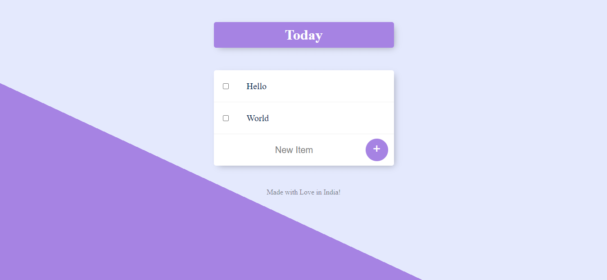

# To-do-List
A Simple To-do list project is built by learning Express, EJS, Bootstrap, RESTful Routes and Backend as MongodB.
<h3>How it Works?</h3>
A user can adds and removes To-do list items by clicking on corresponding buttons. Not only that, user can also surf custom-List-Routes by triggering url as: https://secret-peak-87686.herokuapp.com/<customName>
 
 
